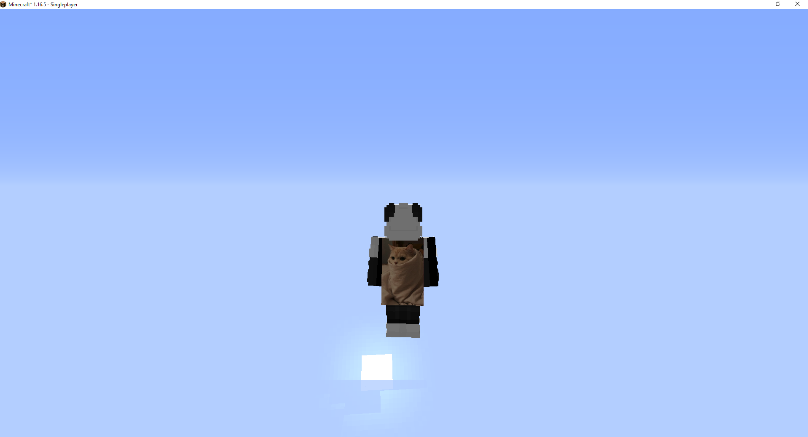

# LightningServer
Lightweight and simple HTTP Server, which is emulating an Optifine's one so is capable to render visual addons to your character in Minecraft.

## Requirements
- At least a little of knowledge on the subject.

## Note
1. You can add new users by adding a new entry to "users" collection. Sample entry:
```json
{
  "username": "luvily",
  "cape": "0001"
}
```

2. You can add new capes by adding a new entry top "capes" collection. Sample entry:
```json
{
  "identifier": "0001",
  "texture": "Binary form of your texture."
}
```

3. You should remember about adding a new entry to your hosts file.
   Location:
   - Linux and Mac OS - "/etc/hosts"
   - Windows - "C:\Windows\System32\drivers\etc\hosts"
   
   You can put there example file, [which you can find there](./assets/hosts) or just add following entry:
   ```text
   127.0.0.1 s.optifine.net
   ```

### Is this really working?


## Contributing
Pull requests are welcome. For major changes, please open an issue first to discuss what you would like to change.

## License
This project is released under [Apache License 2.0](LICENSE).